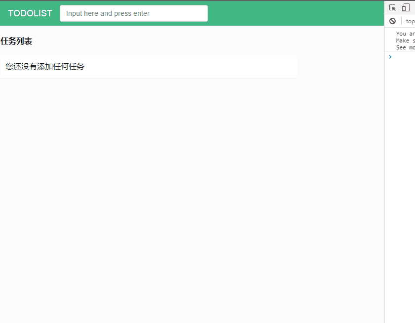

# todolist

> a simple todolist with vue.js

## Build Setup

``` bash
# install dependencies
npm install

# serve with hot reload at localhost:8080
npm run dev

# build for production with minification
npm run build

# build for production and view the bundle analyzer report
npm run build --report
```

## 展示

没有demo链接，贴个截屏的图吧


## 说明

在慕课网的todolist教程的基础上增加了以下功能：

- 可以删除单个item
- 支持item编辑功能
- 显示了未完成任务个数
- 简单做了移动端适配

由于这是入门练手demo，没有用到组件和路由，所有的功能都写在了app.vue文件中，这可能很不优雅。

移动端不支持`dblclick`事件，所以编辑功能在移动端无效，有待改进。

整个demo只用了一个`font awesome`的图标，却引入了整个库，感觉很浪费，而且用的是`@import`引入的，感觉不伦不类。
